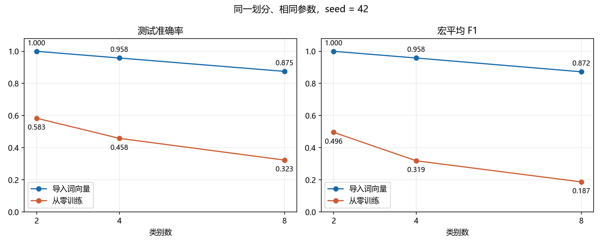
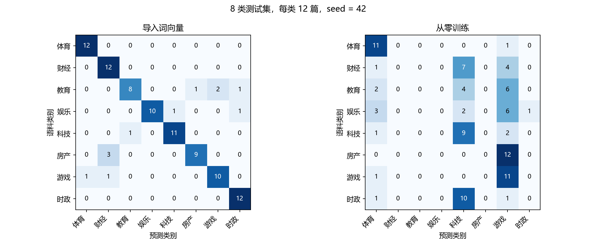

# 用 Gensim 跑表示学习与 fastText 文本分类

本次实际完成了两个学习阶段：先从未使用测试文章的新闻语料训练 Word2Vec 和 FastText 词向量，再用带标签新闻训练官方 fastText 监督分类器，比较导入 FastText 词向量与从零训练的效果。本文记录数据、参数、实测结果和失败分析。

## 一、数据与实验设计

数据取自 [THUCNews 项目](https://github.com/thunlp/THUCTC) 的 [固定镜像版本](https://huggingface.co/datasets/Tongjilibo/THUCNews/tree/ae77e363396e90b54cdaa9eafdbc5e102a3d4019)。选择八个类别文件各自前 1,250 条，共 **10,000 篇**。这是固定文件前缀采样，不能视为从整个新闻总体随机抽样；镜像与原始分发也没有逐篇核验一致性。下载 URL、实际保存前缀长度和 SHA-256 均已记录。

去除空白后不足 100 字、完整正文重复、前 200 字重复，以及分词后不足 50 词的文章后，保留 **9,772 篇**。具体排除数：短／空正文 170 篇，完整重复 13 篇，前 200 字重复 19 篇，分词后过短 26 篇。正文分句后用 jieba（HMM=False）分词，删除标点 token，丢弃不足 3 词的片段。

类别直接继承源文件名，不根据标题生成标签，也没有声称逐篇人工重新标注。每类按种子 42 与文章 ID 的 SHA-256 排序，选 **48 篇监督训练、12 篇测试**。分类输入只用正文的前 500 个词；标题只在错误分析中用于定位。全部 **96 篇测试文章**都先排除，再训练词向量，得到 **9,676 篇、259,322 句、5,721,536 词次**的表示学习语料，其中有 9,292 篇额外未标注材料。

| 类别数 | 类别 | 监督训练 / 测试 |
| --- | --- | --- |
| 2 | 体育、财经 | 96 / 24 |
| 4 | 体育、财经、教育、娱乐 | 192 / 48 |
| 8 | 体育、财经、教育、娱乐、科技、房产、游戏、时政 | 384 / 96 |

2／4／8 类实验沿用相同文章的嵌套划分，不重新挑选容易的测试样本。同一文章及相同正文／前 200 字不会跨训练和测试两侧，但这些检查不能排除所有同事件改写。本次分类语料与题目示例的人民日报语料不同，八类也不同，不能直接比较两份作业的分数。

## 二、表示学习：Word2Vec 与 Gensim FastText

Word2Vec 的 skip-gram 从中心词和相邻词的共现学习表示；Gensim FastText 还为词内字符片段学习表示，组合得到词向量。因此相近向量是语料统计的结果，不能直接当成词典意义。表示模型没有类别输出，后面还需要带标签训练分类映射。

共同参数：skip-gram、100 维、窗口 5、最低词频 3、5 轮、单线程、种子 42，启动 Python 前设置 `PYTHONHASHSEED=0`。FastText 另外使用长度 2—4 的字符 n-gram、200,000 个哈希桶；其余采用所记录版本的默认参数。两者逐行读取同一个分词语料文件。[Word2Vec 文档](https://radimrehurek.com/gensim/models/word2vec.html) · [FastText 文档](https://radimrehurek.com/gensim/models/fasttext.html)

| 模型 | 词表规模 | 本次构建与训练耗时（秒） |
| --- | ---: | ---: |
| Word2Vec | 59,182 | 139.05 |
| FastText | 59,182 | 184.47 |

这是同一台机器的一次运行耗时，包含读取、建词表和训练，不是普遍速度排名。

### 1. 近邻观察

| 查询词 | Word2Vec 前 3 个近邻 | FastText 前 3 个近邻 |
| --- | --- | --- |
| 银行 | 商业银行、发卡行、中国银行 | 银行帐户、富国银行、开户银行 |
| 学校 | 学生、校内、院校 | 我校、技工学校、护士学校 |
| 电脑 | 机器、计算机、笔记本 | 电脑前、电脑病毒、电极 |
| 经济 | 实体、扩大内需、金融体系 | 非经济、沿海经济、会展经济 |

这里只展示四个查询；全部前 10 个近邻及余弦值已保存。共享汉字可能影响 FastText 近邻，需要结合含义检查，不能仅按是否共享字判断好坏。

### 2. 词表外查询

查询“量子计算芯片”“智能养老机器人”“跨境数字人民币钱包”，用 `key_to_index` 检查是否真正进入训练词表，再尝试取得向量。

| 查询 | Word2Vec：在词表 / 可返回向量 | FastText：在词表 / 可返回向量 |
| --- | --- | --- |
| 量子计算芯片 | 否 / 否 | 否 / 是 |
| 智能养老机器人 | 否 / 否 | 否 / 是 |
| 跨境数字人民币钱包 | 否 / 否 | 否 / 是 |

Gensim FastText 利用字符片段合成词表外向量，能返回数值不等于理解了新词；本次还保留了向量范数与返回近邻，没有把“接口成功”计为语义正确。[子词表示论文](https://aclanthology.org/Q17-1010/)

### 3. 四组词的相似度

预先固定体育（足球、篮球、比赛、运动员）、财经（银行、贷款、股票、利率）、教育（学校、学生、教师、课程）、科技（电脑、软件、网络、芯片）四组词。计算无序词对的组内与跨组余弦均值，并记录缺词情况。

| 模型 | 组内均值 | 跨组均值 | 差值 | 有效组内 / 跨组词对 |
| --- | ---: | ---: | ---: | --- |
| Word2Vec | 0.5535 | 0.2367 | 0.3168 | 24 / 96 |
| FastText | 0.5744 | 0.2594 | 0.3150 | 24 / 96 |

这 16 个词均在两个模型的训练词表中。这些词是很小的定性探针，两项平均值都高也不能推出语义更好，更不能替代下游分类评测。

## 三、监督分类：导入词向量与从零训练

将 Gensim FastText 的词表内词向量导出为文本 `.vec`，显式传入 **另一套库**的 `fasttext.train_supervised(pretrainedVectors=...)`。`.vec` 没有转移完整的字符片段参数；Gensim 词向量训练本身也不会自动得到本文的监督分类器。[fastText Python 接口](https://fasttext.cc/docs/en/python-module.html)

分类参数为 100 维、学习率 0.3、25 轮、词二元组、softmax、单线程、最低词频 1、200,000 个哈希桶。字符片段参数 `minn=maxn=0`，因此这一阶段不启用字符子词；词二元组特征仍保留。对照仅去掉 `pretrainedVectors`，沿用同一输入文件、参数与划分。Windows 使用 `fasttext-wheel==0.9.2` 的第三方预编译分发，执行的是 fastText 监督接口。[监督分类论文](https://aclanthology.org/E17-2068/) · [分发记录](https://pypi.org/project/fasttext-wheel/0.9.2/)

### 1. 主结果：随机种子 42

| 类别数 | 导入词向量：答对 / 测试；准确率 / 宏 F1 | 从零训练：答对 / 测试；准确率 / 宏 F1 |
| --- | --- | --- |
| 2 | 24/24；1.000 / 1.000 | 14/24；0.583 / 0.496 |
| 4 | 46/48；0.958 / 0.958 | 22/48；0.458 / 0.319 |
| 8 | 84/96；0.875 / 0.872 | 31/96；0.323 / 0.187 |

### 2. 分类随机性的检查

额外用种子 43、44 跑相同六个条件。下面为三次分类训练的均值 ± 样本标准差；测试集和词向量均没有改变。

| 类别数 | 初始化 | 准确率均值 ± 标准差 | 宏 F1 均值 ± 标准差 |
| --- | --- | --- | --- |
| 2 | 导入词向量 | 1.000 ± 0.000 | 1.000 ± 0.000 |
| 2 | 从零训练 | 0.611 ± 0.024 | 0.541 ± 0.039 |
| 4 | 导入词向量 | 0.958 ± 0.000 | 0.958 ± 0.000 |
| 4 | 从零训练 | 0.438 ± 0.036 | 0.300 ± 0.032 |
| 8 | 导入词向量 | 0.875 ± 0.000 | 0.872 ± 0.000 |
| 8 | 从零训练 | 0.292 ± 0.073 | 0.174 ± 0.055 |

另外，8 类导入词向量模型以种子 42 重训一次，96/96 篇预测与第一次相同。这个检查支持本次环境内的重复性；三个种子不是三个独立测试集，也没有证明换语料或换划分仍然保持优势。

在 8 类测试正文中共有 32,636 个输入词次：在监督训练词集合中出现过的占 88.90%，在导出预训练词表中出现的占 97.67%。这说明额外未标注语料扩大了可复用的词表示覆盖，但覆盖率本身不是分类正确率。

### 3. 补充收敛诊断

看到 25 轮从零训练的低分后，补充 8 类、种子 42 的 100 轮和 250 轮实验，其他参数与文章不变。25 轮两个模型由已保存的二进制重新加载并评估训练集／测试集，没有重复训练它们。

| 初始化 / 轮数 | 训练准确率 | 测试答对 / 96 | 测试准确率 / 宏 F1 | 新训练耗时（秒） |
| --- | ---: | ---: | --- | ---: |
| 导入词向量 / 25 | 0.992 | 84 | 0.875 / 0.872 | 加载已有模型 |
| 从零训练 / 25 | 0.396 | 31 | 0.323 / 0.187 | 加载已有模型 |
| 从零训练 / 100 | 1.000 | 78 | 0.812 / 0.808 | 7.93 |
| 从零训练 / 250 | 1.000 | 83 | 0.865 / 0.860 | 19.85 |

从零训练 25 轮的训练准确率也只有 39.6%，支持训练不足的诊断；100／250 轮训练准确率均为 100%，测试准确率升到 81.3%／86.5%。因此 25 轮的大分差不能解释成从零训练最终只能达到 32.3%。补充实验是在观察主结果后开展的，复用了同一测试集，仅用于诊断；没有把其中最高分当成独立验证过的调参结果。

### 4. 错误分析

8 类、种子 42 的预训练模型错了 **12 篇**：教育 4 篇、娱乐 2 篇、科技 1 篇、房产 3 篇、游戏 2 篇；体育、财经和时政的这批测试样本均正确。逐篇 ID、标题、预测、概率和正文片段在 `errors_8_pretrained.csv`，没有把标题作为分类输入。

| 文章 ID / 标题简述 | 源类别 → 预测 | 观察与判断 |
| --- | --- | --- |
| 房产/265599.txt；万科获建行授信 500 亿 | 房产 → 财经 | 正文讨论银行授信与房地产公司，跨主题明显；源栏目类别未必是唯一语义类别 |
| 游戏/407140.txt；完美时空股价与评级 | 游戏 → 财经 | 公司属于游戏行业，报道重点却是股票与业绩 |
| 游戏/407056.txt；电竞联赛战况 | 游戏 → 体育 | 两类都出现比赛、队伍、战况，需学习电子竞技与传统体育的类别边界 |
| 娱乐/131610.txt；银行高管受贿判决 | 娱乐 → 时政 | 正文包含法院、受贿和判决；这是栏目标签与当前正文主题可能不一致的例子，不能仅据预测确认原标签错误 |
| 科技/482208.txt；增强记忆力药物 | 科技 → 教育 | 科研报道同时出现考试、成绩，模型可能过度依赖相关词；这是根据文本的解释，不是已证明的内部机制 |
| 教育/285593.txt；在耶鲁创办杂志 | 教育 → 游戏 | 留学与校园经历被判为游戏，属于明显误判，不能只用主题交叉解释 |
| 娱乐/131740.txt；电影《南京》解读 | 娱乐 → 科技 | 电影与历史讨论被判成科技，也是模型的实际失败 |

前三类错误提醒我们，频道标签与文章主题可能不同；后两类则说明词向量加分类器仍可能无法形成正确的文档判断。对这 12 篇不进行事后删除或重标来提高本次分数。后续可以预先制定多标签或主主题标注规则，再用新的独立测试集检查。

## 四、实际完成的工作与验证

- 数据下载：8 个固定版本文件前缀，10,000 篇原始新闻；保存来源、长度、ETag 和 SHA-256。
- 表示学习：实际训练 Word2Vec、FastText 各 1 个；查询 4 个词的近邻、3 个词表外组合，并计算固定四组词的组内／跨组词对。
- 监督分类：2／4／8 类 × 2 种初始化 × 3 个随机种子，共 18 次训练，再进行 1 次相同种子重复，主流程共 **19 次分类训练**；收敛诊断另外训练 100／250 轮模型各 1 个，合计 **21 次分类训练**。
- 逐条预测：主对照和额外种子共 1,008 条，重复检查 96 条，共 **1,104 次预测**；收敛诊断另有 384 次测试预测和 1,536 次训练集预测（评估 4 个条件，其中 2 个为加载已有模型）；两部分共 1,488 次测试预测，仍来自 **96 篇独立测试文章**，没有把重复预测当作独立样本。
- 验证：检查文章 ID、正文哈希、前缀哈希唯一，测试集排除于词向量语料，监督训练／测试隔离及嵌套划分；从逐条预测独立复算 18 行准确率、宏 F1 和混淆矩阵，结果一致；另从保存预测复算 4 个收敛条件的训练准确率、测试准确率、测试宏 F1 与混淆矩阵。重复运行的逐条相等在训练进程内断言，再核对保存记录。
- 主流程已计时的预处理、表示模型构建训练、分类训练与预测合计约 414.8 秒；不包含下载、安装、模型存盘、绘图、失败调试和文稿整理。

收敛诊断另记录 4 个模型条件的评估和 2 次新增训练耗时。完整数值、日志和逐条预测见 `results/`；输入哈希在 `data_statistics.json`，逐篇划分在 `document_manifest.csv`。复现步骤见 [REPRODUCE.md](REPRODUCE.md)，来源与局限见 [DATA.md](DATA.md)。

## 五、结论边界与后续工作

**在相同的 25 轮预算下，导入词向量有明显优势；但大幅分差不能全部归因于最终可达到的分类能力。** 8 类主对照中，预训练为 84/96，从零训练为 31/96；补充收敛诊断发现，从零训练 250 轮后达到 83/96，只相差一篇。这使判断从“预训练一定大幅提高最终准确率”收紧为“本次额外未标注语料的词向量能帮助小样本分类更快学到有效表示”。

预训练分类训练约 5.97 秒，250 轮从零训练约 19.85 秒，但前者还先花约 184.47 秒训练 FastText 表示，并使用更多未标注新闻和更大的可用词表。若只训练一个分类任务，不能只比较监督阶段耗时就说整套预训练方案更省；复用词向量时才可能摊薄前期成本。

表示学习的结论也应保留条件：FastText 能合成三个词表外组合的向量；近邻和固定词组的余弦关系体现了统计与字形线索，没有证明新词语义都正确，也没有直接比较 Word2Vec 初始化的分类效果。

本次使用每类 48 篇监督训练、12 篇留出测试。文件前缀采样、固定划分、跨主题报道和未排除的同事件改写都限制了结论。三个分类种子只检查训练随机性；没有评测领域外新闻，也没有训练 Doc2Vec 或系统调整数据规模。这些可以作为后续扩展，不能算入已完成结果。

公开代码与报告：[llm-homework / HW2](https://github.com/idiotGod-LegenDary/llm-homework/tree/main/HW2)。仓库包含脚本、依赖、报告、图和结果，完整语料及模型由本地脚本生成。尚未提交 Piazza。
